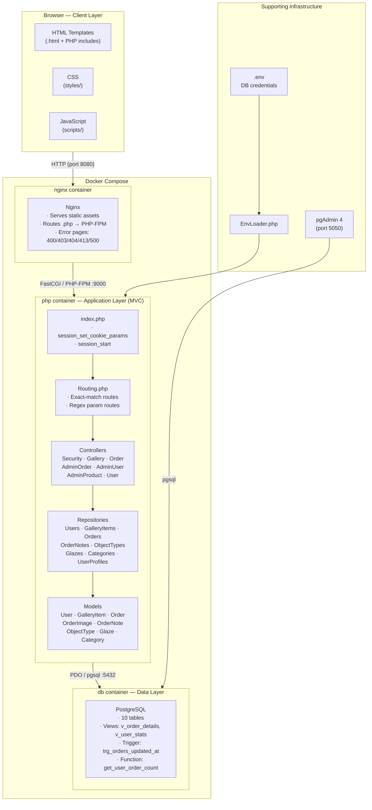
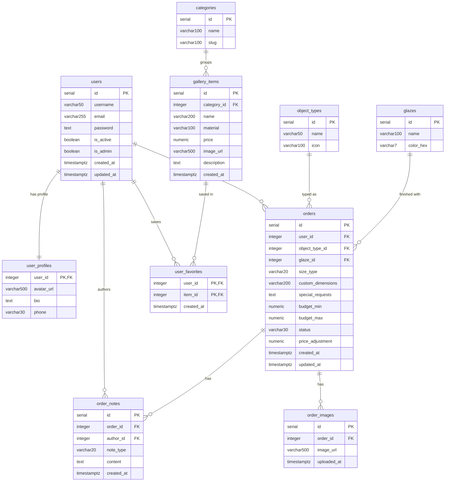

# Terra & Craft — Ceramic Studio App

**Autor:** Jakub Kapała

**Uczelnia:** Politechnika Krakowska | Wydział Informatyki i Matematyki

**Przedmiot:** Wstęp do projektowania aplikacji internetowych

**Semestr:** VI

**Rok akademicki:** 2025/2026

---

## Opis projektu

Aplikacja webowa dla studia ceramiki **Terra & Craft**. Umożliwia klientom przeglądanie galerii wyrobów, składanie spersonalizowanych zamówień przez wieloetapowy wizard oraz zarządzanie kontem. Panel administracyjny zapewnia pełne zarządzanie użytkownikami, zamówieniami i produktami galerii.

---

## Technologie

| Warstwa        | Technologia                         |
| -------------- | ----------------------------------- |
| Serwer WWW     | Nginx                               |
| Backend        | PHP 8.3 (OOP, MVC, bez frameworka)  |
| Baza danych    | PostgreSQL 16                       |
| Frontend       | HTML5, CSS3, Vanilla JS (Fetch API) |
| Konteneryzacja | Docker / Docker Compose             |
| Testy          | PHPUnit 11 (PHAR), Bash / curl      |

---

## Architektura

Projekt stosuje wzorzec **MVC** bez żadnego frameworka.

```
Browser
  └─► Nginx  (static files, error pages, reverse proxy)
        └─► PHP-FPM  (index.php → Routing → Controllers → Repositories → Models)
                └─► PostgreSQL  (tables, views, trigger, function)
```



Diagram warstwowy (Mermaid): [`docs/diagrams/architecture.mmd`](docs/diagrams/architecture.mmd)

---

## Uruchomienie

### Wymagania

- Docker Desktop (lub Docker Engine + Compose plugin)
- Git

### Kroki

```bash
git clone <repo-url>
cd pk-wdpai-2026

# Skopiuj przykładowy plik środowiskowy
cp .env.example .env

# Uruchom aplikację
docker compose up -d
```

Aplikacja dostępna pod adresem: **http://localhost:8080**
pgAdmin dostępny pod adresem: **http://localhost:5050**

### Zatrzymanie

```bash
docker compose down
```

---

## Zmienne środowiskowe

Plik `.env` (na podstawie `.env.example`):

```env
DB_HOST=db
DB_PORT=5432
DB_DATABASE=db
DB_USERNAME=docker
DB_PASSWORD=docker
```

> Plik `.env` jest wykluczony z repozytorium (`.gitignore`).

---

## Konta testowe

Wszystkie konta mają hasło: **`password123`**

| E-mail               | Rola          |
| -------------------- | ------------- |
| admin@terracraft.com | Administrator |
| alice@example.com    | Użytkownik    |
| ben@example.com      | Użytkownik    |
| david@example.com    | Użytkownik    |
| eva@example.com      | Użytkownik    |

---

## Funkcjonalności

### Użytkownik

- Rejestracja i logowanie z walidacją po stronie serwera
- Przeglądanie galerii z filtrowaniem po kategorii
- Dodawanie i usuwanie ulubionych
- Wieloetapowy wizard zamówień (typ, glazura, rozmiar, budżet, zdjęcia inspiracji)
- Dashboard: historia zamówień i ulubione

### Administrator

- Zarządzanie użytkownikami (role, aktywność, usuwanie)
- Zarządzanie zamówieniami (statusy, notatki wewnętrzne, wiadomości do klienta)
- Zarządzanie produktami galerii (tworzenie, edycja z uploadem zdjęcia, usuwanie)

---

## Baza danych

### Schemat

10 tabel: `users`, `user_profiles`, `categories`, `gallery_items`, `object_types`, `glazes`, `orders`, `order_images`, `order_notes`, `user_favorites`

**Typy relacji:**

- **1:1** — `users` ↔ `user_profiles`
- **1:many** — `users` → `orders`, `orders` → `order_notes`, `orders` → `order_images`, `categories` → `gallery_items` itd.
- **many:many** — `users` ↔ `gallery_items` (przez tabelę `user_favorites`)

### Widoki (minimum 2)

| Widok             | Opis                                                                        |
| ----------------- | --------------------------------------------------------------------------- |
| `v_order_details` | Zamówienia z danymi klienta, typem obiektu i glazurą (JOIN 4 tabel)         |
| `v_user_stats`    | Statystyki użytkowników: liczba zamówień, suma wydatków, ostatnia aktywność |

### Wyzwalacz

`trg_orders_updated_at` — automatycznie aktualizuje pole `updated_at` przy każdej modyfikacji rekordu w tabeli `orders`.

### Funkcja

`get_user_order_count(p_user_id)` — zwraca całkowitą liczbę zamówień dla podanego użytkownika.

### Diagram ERD



Plik źródłowy: [`docs/diagrams/erd.mmd`](docs/diagrams/erd.mmd)

---

## Screeny aplikacji

### Wersja webowa

<!-- TODO -->

### Wersja mobilna

<!-- TODO -->

---

## Testy

### Testy jednostkowe (PHPUnit)

Uruchomienie wewnątrz kontenera Docker:

```bash
docker exec -w /app pk-wdpai-2026-php-1 php tests/phpunit.phar --configuration tests/phpunit.xml
```

Lub lokalnie (wymaga PHP 8.2+, skrypt pobiera plik `.phar` automatycznie przy pierwszym uruchomieniu):

```bash
bash tests/run.sh
```

Pokrycie testami:

- `GalleryItemTest` — konstruktor, pola nullable
- `UserTest` — gettery, wartości domyślne, flaga admina
- `GalleryItemsRepositoryTest` — `getAll()`, `getById()` z mock PDO (Reflection API)

### Testy integracyjne

Wymagają uruchomionego stosu Docker:

```bash
bash tests/integration-tests.sh http://localhost:8080
```

Sprawdzane scenariusze (10 przypadków):

- `GET /login` → 200
- `GET /gallery` bez sesji → 302 (przekierowanie do logowania)
- `GET /admin/*` bez sesji → 302
- `GET /nonexistent` → 404
- `POST /login` z błędnymi danymi i poprawnym tokenem CSRF → 200

---

## Scenariusz testowy

### 1. Logowanie i role

1. Otwórz **http://localhost:8080**
2. Zaloguj się jako `admin@terracraft.com` / `password123`
3. Sprawdź przekierowanie do `/admin/users`
4. Wyloguj się -> przycisk w lewym dolnym rogu sidebara
5. Zaloguj się jako `alice@example.com` / `password123`
6. Sprawdź przekierowanie do `/gallery`

### 2. Ochrona tras (403 / 302)

1. Będąc zalogowanym jako zwykły użytkownik, wejdź ręcznie na `/admin/users`
2. Oczekiwany wynik: strona **403 Forbidden**
3. Wyloguj się całkowicie i wejdź na `/gallery`
4. Oczekiwany wynik: przekierowanie **302** → `/login`

### 3. CRUD użytkowników (admin)

1. Zaloguj się jako admin → `/admin/users`
2. Kliknij **Add User**, wypełnij formularz i zapisz
3. Edytuj nowo dodanego użytkownika — zmień rolę na Admin
4. Usuń użytkownika — potwierdź w modalu
5. Spróbuj usunąć własne konto → błąd `cannot_delete_self`

### 4. Zarządzanie zamówieniami (admin)

1. Przejdź do `/admin/orders`
2. Kliknij wybrane zamówienie aby zobaczyć szczegóły
3. Zmień status na `approved` i zapisz
4. Sprawdź, że `updated_at` zostało zaktualizowane — wyzwalacz `trg_orders_updated_at` zadziałał
5. Dodaj notatkę wewnętrzną (zakładka _Internal_)
6. Wyślij wiadomość do klienta (zakładka _Customer_)

### 5. Zarządzanie produktami (admin)

1. Przejdź do `/admin/products`
2. Kliknij **Add Product** — wypełnij formularz, dodaj zdjęcie
3. Edytuj produkt — zmień cenę i zamień zdjęcie
4. Usuń produkt — potwierdź w modalu

### 6. Galeria i ulubione (użytkownik)

1. Zaloguj się jako `alice@example.com`
2. Przejdź do galerii → filtruj po kategorii _Vases_
3. Kliknij serduszko przy wybranym produkcie → dodaj do ulubionych
4. Przejdź do **My Account** → sprawdź sekcję _Saved Favourites_
5. Kliknij serduszko ponownie → usuń z ulubionych

### 7. Składanie zamówienia (użytkownik)

1. Kliknij **Order** w nawigacji
2. Przejdź wszystkie 5 kroków wizarda:
   - Typ obiektu (np. Vase)
   - Glazura (np. Deep Teal)
   - Rozmiar (np. Custom + własne wymiary)
   - Budżet i opis specjalny
   - Zdjęcia inspiracji (opcjonalne)
3. Wyślij zamówienie → sprawdź w **My Account** w sekcji _Order History_

### 8. Strona 404

1. Wejdź na dowolny nieistniejący adres, np. `/strona-ktora-nie-istnieje`
2. Oczekiwany wynik: strona **404 Not Found**

### 9. Widoki i funkcja bazodanowa

Połącz się z bazą przez pgAdmin (**http://localhost:5050**, login: `admin@example.com` / `admin`):

```sql
-- Widok 1: szczegóły zamówień
SELECT * FROM v_order_details;

-- Widok 2: statystyki użytkowników
SELECT * FROM v_user_stats;

-- Funkcja: liczba zamówień użytkownika o id=2
SELECT get_user_order_count(2);
```

---

## Security Bingo

| #   | Wymaganie                                                        | Status |
| --- | ---------------------------------------------------------------- | ------ |
| 1   | Ochrona przed SQL injection (prepared statements)                | ✅     |
| 2   | Nie zdradzam czy email istnieje — "Invalid email or password"    | ✅     |
| 3   | Walidacja formatu email po stronie serwera (`filter_var`)        | ✅     |
| 4   | `UsersRepository` zarządzany jako singleton                      | ✅     |
| 5   | Login/register przyjmuje dane tylko na POST, GET renderuje widok | ✅     |
| 6   | CSRF token w formularzu logowania                                | ✅     |
| 7   | CSRF token w formularzu rejestracji                              | ✅     |
| 8   | Ograniczona długość wejścia (email 255, hasło 128, imię 100)     | ✅     |
| 9   | Hasła przechowywane jako hash bcrypt (`password_hash`)           | ✅     |
| 10  | Hasła nigdy nie są logowane                                      | ✅     |
| 11  | Regeneracja ID sesji po poprawnym logowaniu                      | ✅     |
| 12  | Cookie sesji z flagą HttpOnly                                    | ✅     |
| 13  | Cookie sesji z flagą Secure (auto-detect HTTPS)                  | ✅     |
| 14  | Cookie z `SameSite=Lax`                                          | ✅     |
| 15  | Limit prób logowania (5 prób → blokada 15 minut)                 | ✅     |
| 16  | Walidacja złożoności hasła (min. 8 znaków)                       | ✅     |
| 17  | Przy rejestracji sprawdzam czy email jest już w bazie            | ✅     |
| 18  | Dane w widokach escapowane (`htmlspecialchars`)                  | ✅     |
| 19  | Brak stack trace w produkcji — własne strony błędów              | ✅     |
| 20  | Sensowne kody HTTP (400/403/404/413/500)                         | ✅     |
| 21  | Hasło nie jest przekazywane do widoków                           | ✅     |
| 22  | Z bazy pobieram tylko niezbędne kolumny użytkownika              | ✅     |
| 23  | Poprawne wylogowanie — niszczę sesję                             | ✅     |
| 24  | Logowanie nieudanych prób logowania (`error_log`, bez haseł)     | ✅     |

---

## Checklista wymagań

### Obowiązkowe

- [x] Architektura MVC, kod obiektowy zgodny z SOLID
- [x] Docker Compose (nginx + PHP-FPM + PostgreSQL + pgAdmin)
- [x] Proces logowania, utrzymanie sesji, wylogowanie
- [x] Uprawnienia użytkowników (admin / user) weryfikowane przy każdym żądaniu
- [x] Zarządzanie użytkownikami (CRUD)
- [x] Responsywny design (CSS media queries)
- [x] Baza danych: wszystkie typy relacji (1:1, 1:many, many:many)
- [x] Minimum 2 widoki SQL z JOIN-ami
- [x] Minimum 1 wyzwalacz
- [x] Minimum 1 funkcja PL/pgSQL
- [x] Transakcje na odpowiednim poziomie izolacji (PDO domyślnie READ COMMITTED)
- [x] Obsługa błędów: strony 400 / 403 / 404 / 413 / 500
- [x] PHPUnit: testy modeli i repozytorium (bez Composera — PHAR)
- [x] Testy integracyjne endpointów (skrypt curl/bash)
- [x] Diagram ERD (`docs/diagrams/erd.mmd`)
- [x] Diagram architektury (`docs/diagrams/architecture.mmd`)
- [x] Plik `.env.example` z opisem zmiennych środowiskowych
- [x] Systematyczne commity w publicznym repozytorium Git
- [x] Brak duplikacji kodu
- [x] Wszystkie 24 punkty Security Bingo

### Dodatkowe

- [x] Custom Order Wizard (wieloetapowy formularz z Fetch API)
- [x] Interaktywne modale
- [x] Upload zdjęć (zamówienia i produkty galerii)
- [x] Panel klienta: historia zamówień i ulubione
- [x] System notatek do zamówień (wewnętrzne i do klienta)
- [x] Własny `EnvLoader` — konfiguracja przez `.env` zamiast `config.php`
